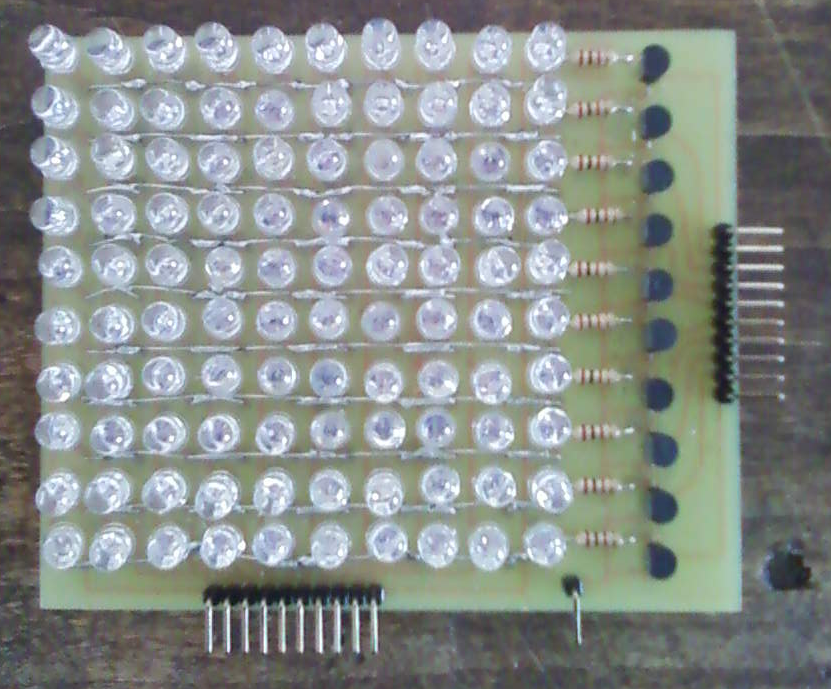
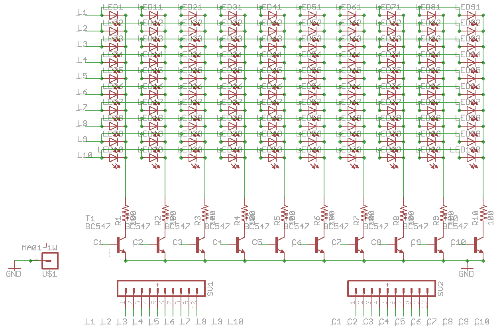
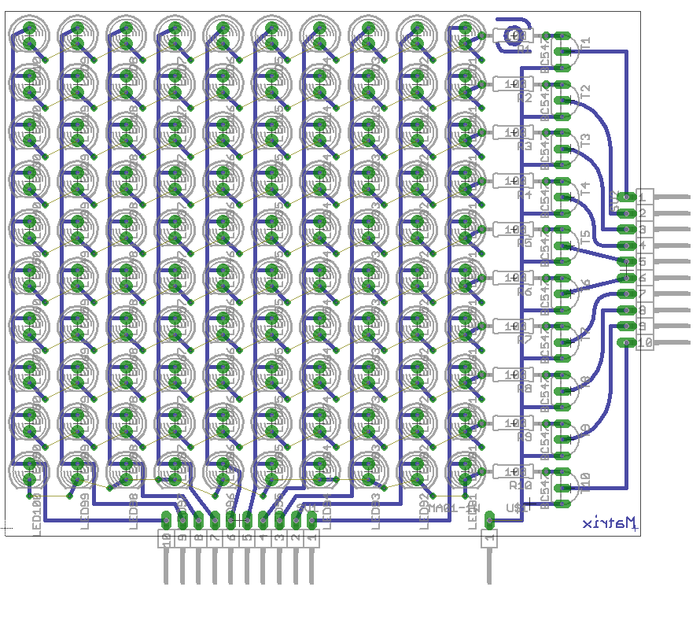
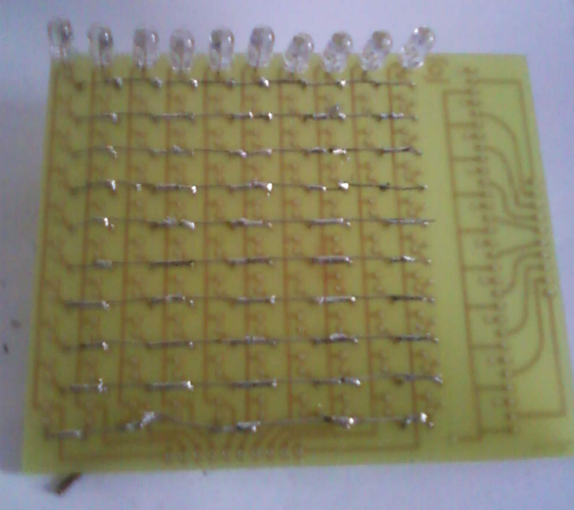
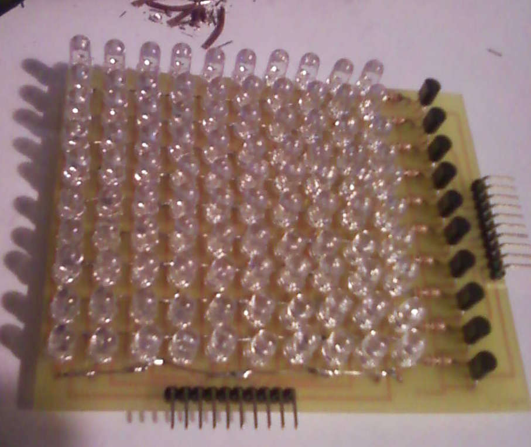

---
layout: post
title: Construire sa matrice de led 10x10 pour l'utiliser avec une carte Arduino.
description: Réalisation des pistes et soudure d'une matrices de diodes pour utiliser
  comme surface d'affichage avec une carte arduino.
author: Jérémy Cochoy
date: 2012-06-06 +0100
categories: hardware led diy arduino
lang: fr
redirect_from:
  - /site/blog/posts/led-matrix-10x10/fr.html
  - /blog/led-matrix-10x10/data/
...

## Matrice de LED 10x10 pour une alimentation 5V

Dans ce billet, je vais développer les différentes étapes dans la réalisation d'une matrice de diode 10x10 pour une utilisation avec des tensions de 5V (Il faudra prévoir une/des résistances dans le circuit qui contrôleras les transistors).

Quel est l’intérêt de réaliser une matrice soit même?
Certainement pas le prix, puisqu'on trouve des matrices 8x8 à 3€ sur un célèbre site d'enchère.
Ni la qualité esthétique, puisque vous vous rendrez vite compte qu’aligner parfaitement les diodes relèverais du miracle.

Non, ce que l'on cherche ici, c'est la satisfaction d'avoir réalisé son premier circuit, et d'avoir fait le premier pas vers un nouveau monde. À mes yeux, ce projet est le plus simples des projets utile accessible à un néophyte, et fait suite à l'hello world.

Je vous fourni le projet Eagle contenant schéma et PCB, pour que vous puissiez imprimer le PCB ou simplement modifier le design ; [led_matrix.7z](data/led_matrix.7z).

## Dessin du circuit (PCB), détermination des composants

La première étape consiste à réaliser le circuit via un logiciel spécialisé, par exemple Eagle, en s’aidant des lois de la physique (Loi des mailles, des noeuds, et U=RI :) ) pour s'assurer que l'on a les bonnes tensions / intensités. J'ai réaliser les calculs pour des leds vertes haute luminosité. Notez que le seuil de tension (aussi appelé Forward Voltage) des led vari aelon les couleurs (2~2.6v pour les rouges/oranges/jaunes et 3~4V pour les vertes/bleu). Dans la configuration que j'ai réaliser, prévu pour une alimentation de 5V, on ne peut allumer les LED qu'une à une pour espérer une intensité lumineuse acceptable. Dans l'ensemble, pour l'adapter a d'autres tensions, vous pouvez vous contenter de recalculer/mesurer les résistances.

Notez que les transistors n'ont pas de résistance sur leur base. Vous DEVEZ en placer. Pour ma part elles figureront coté contrôleur, car je prévoir l'usage d'un démultiplexeur qui diminuera le nombre de résistances nécessaires.

Voilà la bête :

Une fois le schéma réalisé, le choix des connecteurs fait, les connexions vérifiés, on peut passer au dessin du PCB. Une petite réflexion vous conduira a la conclusion qu'il est impossible de relier les connexions avec une piste de cuivre simple face sans qu'elles se chevauchent. La solution? De petits fils qui vont venir jouer le rôle de pont. Cela se caractérise par le fait que les pistes ne sont pas complètement reliés, comme Eagle l’indique par la présence de 'fils aériens'. Sachez au passage que j'ai du réaliser le rooting (câblage) à la main, pour obtenir quelque chose d'esthétique.

Après tout ce travail, il ne reste qu'à prier pour que ne figurent pas d'erreurs, et fabriquer le circuit.

## Le montage

Après quelques semaines, je reçoit le circuit que j'avais commandé. Et oui, vous avez crus que je ferait le circuit moi même? Commandé auprès d'un particulier qui ne traite que les commandes de particuliers ; <http://etronics.free.fr> si vous me demandez de le dénoncer. Je sort les câbles, la soudure, et me prépare à poser la "deuxième couche" du circuit. Ah mais, il ne manquerait pas la moitié des trous?!

--------------------------------------------------------------------------------

Bon, on essaye de retourner la situation à son avantage. Et si on se contentais de petites agrafes reliés entre elles via un long fil métallique? Mais oui! Ça fonctionne, et c'est même très pratique!

Après ceci vous pouvez commencer à placer les composants. Commencez par les résistances puis les diodes (dans l'ordre inverse vous aurez du mal à les monter...).

Viennent alors les derniers composants : transistors, headers, OUF!
C'est terminé!

## Petit rappel sur l'utilisation

 -  On n'allume qu'une led à la fois, quitte à le faire assez vite pour donner
    l'illusion que plusieurs sont allumé en même temps. Un affichage à 60kHz est suffisant.
 -  Il faut penser à mettre des résistances sur la base des transistors
    (Les headers C1-C10).
 -  Pour activer la diode en (4,8) (Avec la disposition où est prise la
    première photographie) on branche 5V sur L8 et l'on active C4 avec par
	exemple une résistance 10K relié à 5V.

__À vous de faire une plus grosse matrice! ;)__

__NB :__ Le montage que j'ai fait n'est pas la seul solution pour réduire le nombre
de connections. Il existe des multiplexages à 'haute impédance', se basant sur
le fait que l'on ne connecte que 2 broches sur l'ensemble des combinaisons
possible ([Sonelec-musique](http://www.sonelec-musique.com/electronique_bases_affichage_multiplexage.html)).
Je ne garantit pas que ce soit une bonne idée pour utiliser conjointement avec
des LED haute luminosité et un microcontroleur. Si quelqu'un a testé, je suis
curieux de savoir ce que ça donne.
